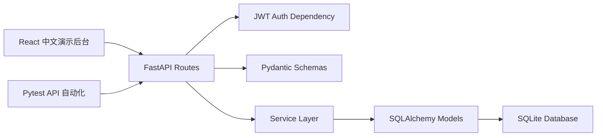
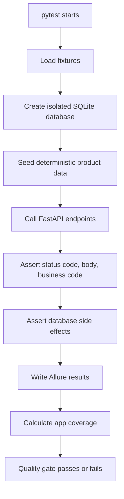
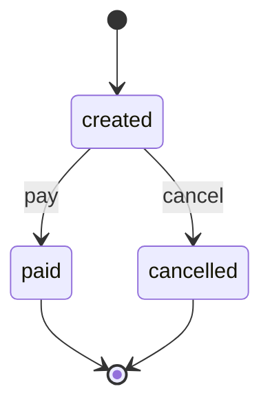

# Architecture

## Application Layers

## Automation Test Flow

## Order State Machine

Invalid transitions covered by automated tests:

- `paid -> cancelled`
- `cancelled -> paid`
- `paid -> paid`

## Why This Design Helps Interviews

- The backend is small enough to explain in a few minutes.
- The frontend makes the core workflow easier to demonstrate than Swagger alone.
- The test suite proves business behavior, not only HTTP status codes.
- Fixtures show test data setup and cleanup ability.
- Database assertions show that API tests can verify real persistence effects.
- CI quality gate shows how automation protects code changes before merge.
